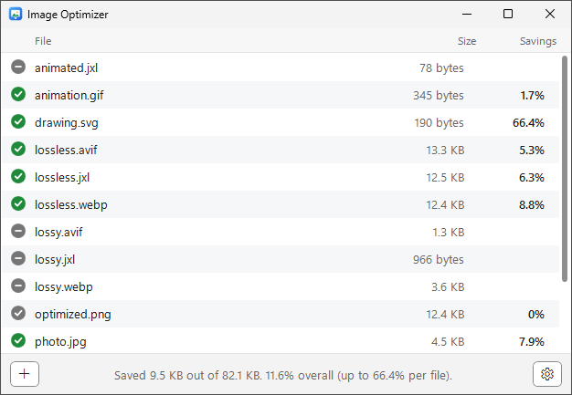
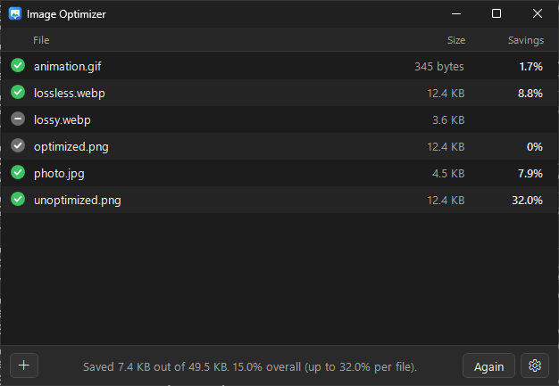

# Image Optimizer

A lightweight, fast, lossless image optimizer for Windows, inspired by [ImageOptim](https://imageoptim.com/) on the Mac.

Drop PNG, JPEG, WebP, GIF and SVG files (or whole folders) onto the window. Each file is optimized and
**replaced in place**. There's nothing to configure: the defaults are safe, and a small Settings panel
(gear button) is there if you want it.

Click the File, Size or Savings header to sort the list (click again to reverse it).
The app follows the Windows light or dark app mode automatically.

| Light                                                       | Dark                                                      |
| ----------------------------------------------------------- | --------------------------------------------------------- |
|  |  |

## How it stays lossless and safe

1. The original is copied to a private temporary folder; the optimizers only ever see that copy.
2. The format's optimizer writes one or more candidates (for JPEG, both baseline and progressive).
3. Candidates that aren't **strictly smaller** than the original are thrown away.
4. The smallest candidate is decoded and compared **pixel by pixel** with the original
   (Windows imaging for PNG/JPEG, `dwebp` for WebP). Any difference and it's discarded.
5. If the file changed on disk in the meantime, nothing is written.
6. Only then is the original swapped for the candidate in a single `File.Replace` step.

If anything fails along the way, the original file is left exactly as it was.

| Format | Tool                                                                         | What it does                                                                                                                                                      |
| ------ | ---------------------------------------------------------------------------- | ----------------------------------------------------------------------------------------------------------------------------------------------------------------- |
| PNG    | [oxipng](https://github.com/oxipng/oxipng)                                   | Lossless filter, bit depth, palette and deflate optimization. Animated PNGs are left untouched.                                                                   |
| JPEG   | `jpegtran` from [libjpeg-turbo](https://libjpeg-turbo.org/)                  | Optimized Huffman tables and progressive encoding, without touching the image data.                                                                               |
| WebP   | `cwebp` / `webpmux` from [libwebp](https://developers.google.com/speed/webp) | Lossless WebPs are re-encoded losslessly. Lossy WebPs are never re-encoded, only stripped of metadata.                                                            |
| GIF    | [Gifsicle](https://www.lcdf.org/gifsicle/)                                   | `-O3` lossless frame and LZW optimization.                                                                                                                        |
| SVG    | [SVGO](https://github.com/svg/svgo)                                          | SVGO's default preset, run in the built-in [Jint](https://github.com/sebastienros/jint) engine (no Node.js needed). SVGs are text, so they aren't pixel-compared. |

By default metadata (EXIF, comments, camera info) is removed, but color profiles and JPEG
orientation are always kept so images look exactly the same.

## Settings

- Formats to optimize (PNG, JPEG, WebP, GIF, SVG)
- Remove metadata (on by default)
- Maximum compression: Zopfli for PNG, maximum effort for WebP, multipass SVGO (off by default; much slower)
- Allow progressive JPEG (on by default)
- Keep each file's original "Date modified" (off by default)

Settings are stored in `%AppData%\ImageOptimizer\settings.json`.

## Requirements

Windows 10 or 11 (x64) with the [.NET 10 Desktop Runtime](https://dotnet.microsoft.com/download/dotnet/10.0).
Windows offers to download it the first time if it's missing.

## Building

```powershell
./scripts/fetch-tools.ps1          # downloads the pinned optimizer binaries into ./tools
dotnet build ImageOptimizer.sln
dotnet test ImageOptimizer.sln
dotnet publish src/ImageOptimizer.App -c Release -r win-x64 --self-contained false -o publish
```

Every push is built and tested on Windows by GitHub Actions, and the ready-to-run app is attached
to the workflow run as the `ImageOptimizer-win-x64` artifact.

The engine (`src/ImageOptimizer.Core`) is cross-platform, so its tests also run on Linux or macOS
with `oxipng`, `jpegtran`, `cwebp`/`dwebp`/`webpmux` and `gifsicle` on the `PATH`.

## License

Image Optimizer is released under the [MIT License](LICENSE). The bundled tools keep their own
licenses; see [THIRD-PARTY-NOTICES.md](THIRD-PARTY-NOTICES.md).
